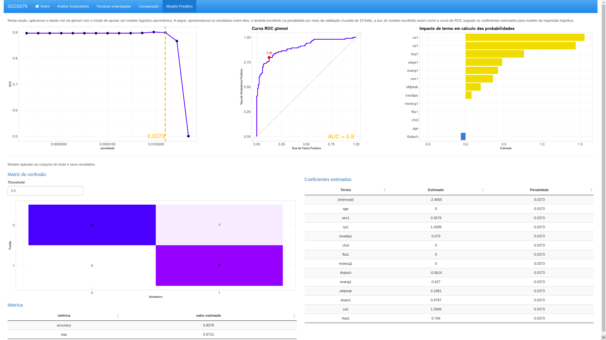

Esta pasta contem os seguintes arquivos:

1. **heart_clevelend.csv**: Conjunto de dados com dimensão 297 X 14.
2. **aed.R**: Rscript contem códigos de execução de análise exploratória.
3. **heart.R**: Rscript contem códigos que executa algoritmo de modelagem.
4. **app.R**: Arquivo shiny que produz dashboard.

Para gerar o dashboard interativo :
- Abrir o arquivo "app.R".
- Checar se tem os pacotes instalados, consulta a lista.
- Se for abrir no RStudio, clique no botão "Run App" localizado no canto superior do script.
- Se for abrir no VScode, em ambiente R, roda o comando "shiny::runApp()".

### Pacotes usados
pack <- c(
  "shiny", 
  "shinydashboard", 
  "shinydashboardPlus", 
  "shinyWidgets", 
  "shinyBS",
  "shinycssloaders", 
  "DT",
  "tidyverse",
  "tidymodels",
  "MASS",
  "dismo",
  "infotheo",
  "GGally",
  "glmnet",
  "skimr",
  "randomForest"
 )

### Descrição de dados

### Exemplo de AED

### Implementação de algoritmo

### Comparação de performance

### Modelo preditivo
